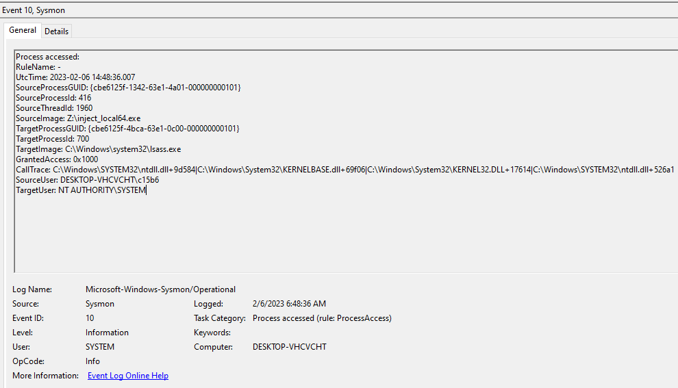

# HW Call Stack

Yet another "Call Stack Spoofing" implementation. Works for syscalls and APIs, supports x64, x86 and WoW64.  



## Compile
Use the MinGW compiler:
```bash
make
```

This should create two binaries:
```
$ ls dist  
hw_call_stack.x64.exe  hw_call_stack.x86.exe
```

## Example output
```
PS C:\Windows\Temp> .\hw_call_stack.x64.exe
usage: C:\Windows\Temp\hw_call_stack.x64.exe <pid> <dll>

PS Z:\> .\hw_call_stack.x64.exe 700 kernel32.dll
-- HW Call Stack --

calling NtOpenProcess...
DEBUG: source/spoof_callstack.c:850:create_fake_callstack(): obtained the stack ranges: 0x000000287d3fd000 - 0x000000287d400000
DEBUG: source/spoof_callstack.c:863:create_fake_callstack(): using the NtOpenProcess call stack
DEBUG: source/spoof_callstack.c:892:create_fake_callstack(): storing area is at: 0x0000020121124940
DEBUG: source/spoof_callstack.c:920:create_fake_callstack(): size of the fake stack: 0x158
DEBUG: source/spoof_callstack.c:924:create_fake_callstack(): fake stack on the heap: 0x00000201211315a0 - 0x00000201211316f8
DEBUG: source/spoof_callstack.c:933:create_fake_callstack(): backup of the stack real stack: 0x0000020121131700 - 0x0000020121134700
DEBUG: source/spoof_callstack.c:943:create_fake_callstack(): the spoofed call stack will be stored at: 0x000000287d3ffea8 - 0x000000287d400000
DEBUG: source/spoof_callstack.c:1010:create_fake_callstack(): fake stack layout:
DEBUG: source/spoof_callstack.c:1011:create_fake_callstack():     ~~~~~~~~~~~~~~~~~~~~~~~~~~~~~~~
DEBUG: source/spoof_callstack.c:1021:create_fake_callstack():     ret address: KernelBase!ProcessIdToSessionId+0x96 <-- stack pointer: 0x000000287d3ffea8
DEBUG: source/spoof_callstack.c:1039:create_fake_callstack():     -------------------------------
DEBUG: source/spoof_callstack.c:1040:create_fake_callstack():         <0x78 bytes of space>
DEBUG: source/spoof_callstack.c:1032:create_fake_callstack():     ret address: Kernel32!BaseThreadInitThunk+0x14
DEBUG: source/spoof_callstack.c:1039:create_fake_callstack():     -------------------------------
DEBUG: source/spoof_callstack.c:1040:create_fake_callstack():         <0x28 bytes of space>
DEBUG: source/spoof_callstack.c:1032:create_fake_callstack():     ret address: ntdll!RtlUserThreadStart+0x21
DEBUG: source/spoof_callstack.c:1039:create_fake_callstack():     -------------------------------
DEBUG: source/spoof_callstack.c:1040:create_fake_callstack():         <0x78 bytes of space>
DEBUG: source/spoof_callstack.c:1044:create_fake_callstack():     ret address: 0x0000000000000000
DEBUG: source/spoof_callstack.c:1045:create_fake_callstack():     -------------------------------
DEBUG: source/spoof_callstack.c:1046:create_fake_callstack():     canary: 0xdeadbeefcafebabe
DEBUG: source/spoof_callstack.c:1047:create_fake_callstack():     storing ptr: 0x0000020121124940
DEBUG: source/spoof_callstack.c:1048:create_fake_callstack():         <0x10 bytes of space>       <-- stack bottom: 0x000000287d3fd000
DEBUG: source/spoof_callstack.c:1049:create_fake_callstack():     ~~~~~~~~~~~~~~~~~~~~~~~~~~~~~~~
DEBUG: source/syscalls.c:630:trigger_syscall(): created the fake callstack
DEBUG: source/syscalls.c:644:trigger_syscall(): hardware breakpoint set at 0x00007ffa42db9f06
DEBUG: source/syscalls.c:674:trigger_syscall(): triggering the syscall...
DEBUG: source/syscalls.c:676:trigger_syscall(): done.
status: 0x0

calling LoadLibraryA...
DEBUG: source/spoof_callstack.c:850:create_fake_callstack(): obtained the stack ranges: 0x000000287d3fd000 - 0x000000287d400000
DEBUG: source/spoof_callstack.c:867:create_fake_callstack(): using the LoadLibraryA call stack
DEBUG: source/spoof_callstack.c:892:create_fake_callstack(): storing area is at: 0x00000201211376f0
DEBUG: source/spoof_callstack.c:920:create_fake_callstack(): size of the fake stack: 0x1f8
DEBUG: source/spoof_callstack.c:924:create_fake_callstack(): fake stack on the heap: 0x00000201211317e0 - 0x00000201211319d8
DEBUG: source/spoof_callstack.c:933:create_fake_callstack(): backup of the stack real stack: 0x0000020121138a50 - 0x000002012113ba50
DEBUG: source/spoof_callstack.c:943:create_fake_callstack(): the spoofed call stack will be stored at: 0x000000287d3ffe08 - 0x000000287d400000
DEBUG: source/spoof_callstack.c:1010:create_fake_callstack(): fake stack layout:
DEBUG: source/spoof_callstack.c:1011:create_fake_callstack():     ~~~~~~~~~~~~~~~~~~~~~~~~~~~~~~~
DEBUG: source/spoof_callstack.c:1025:create_fake_callstack():     ret address: advapi32+0x4a25e <-- stack pointer: 0x000000287d3ffe08
DEBUG: source/spoof_callstack.c:1039:create_fake_callstack():     -------------------------------
DEBUG: source/spoof_callstack.c:1040:create_fake_callstack():         <0x118 bytes of space>
DEBUG: source/spoof_callstack.c:1032:create_fake_callstack():     ret address: Kernel32!BaseThreadInitThunk+0x14
DEBUG: source/spoof_callstack.c:1039:create_fake_callstack():     -------------------------------
DEBUG: source/spoof_callstack.c:1040:create_fake_callstack():         <0x28 bytes of space>
DEBUG: source/spoof_callstack.c:1032:create_fake_callstack():     ret address: ntdll!RtlUserThreadStart+0x21
DEBUG: source/spoof_callstack.c:1039:create_fake_callstack():     -------------------------------
DEBUG: source/spoof_callstack.c:1040:create_fake_callstack():         <0x78 bytes of space>
DEBUG: source/spoof_callstack.c:1044:create_fake_callstack():     ret address: 0x0000000000000000
DEBUG: source/spoof_callstack.c:1045:create_fake_callstack():     -------------------------------
DEBUG: source/spoof_callstack.c:1046:create_fake_callstack():     canary: 0xdeadbeefcafebabe
DEBUG: source/spoof_callstack.c:1047:create_fake_callstack():     storing ptr: 0x00000201211376f0
DEBUG: source/spoof_callstack.c:1048:create_fake_callstack():         <0x10 bytes of space>       <-- stack bottom: 0x000000287d3fd000
DEBUG: source/spoof_callstack.c:1049:create_fake_callstack():     ~~~~~~~~~~~~~~~~~~~~~~~~~~~~~~~
DEBUG: source/syscalls.c:733:trigger_api(): created the fake callstack
DEBUG: source/syscalls.c:747:trigger_api(): hardware breakpoint set at 0x00007ffa4331a25e
DEBUG: source/syscalls.c:775:trigger_api(): triggering the API...
DEBUG: source/syscalls.c:777:trigger_api(): done.
Kernel32.dll has been loaded at 0x00007ffa435e0000

Bye!
```

## Credits
Thanks to [William Burgess](https://twitter.com/joehowwolf) for [Spoofing Call Stacks To Confuse EDRs](https://labs.withsecure.com/blog/spoofing-call-stacks-to-confuse-edrs).
